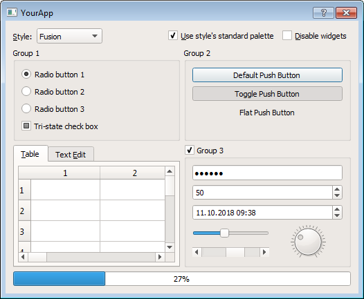

# What is Qt? 

**It's a framework for creating GUI's as well as cross-platform applications that run on various software and hardware platforms**

It usually looks like this:

It's pronounced "cute" or "q t" 

free, open-source and cross-platform 

It runs on the following, with little or no change in the underlying codebase while still being a native application with native capabilities and speed:
  - Linux, 
  - Windows, 
  - macOS, 
  - Android or 
  - embedded systems 

Qt has support for Python
  - (it also supports C++ and Qt QML - a declarative language with the ability to describe business logic with JavaScript)
  - Latest python binding is PySide6, we'll focus on PySide2

# Let's have a look at some code 

demo_1.py

demo_2.py
