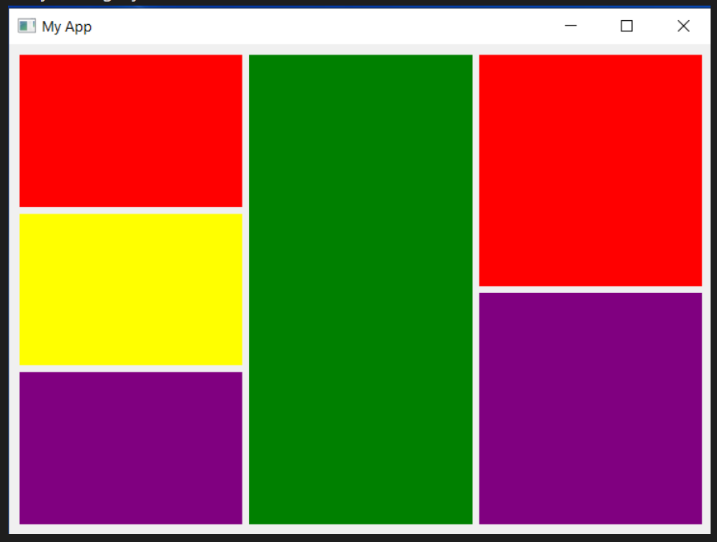
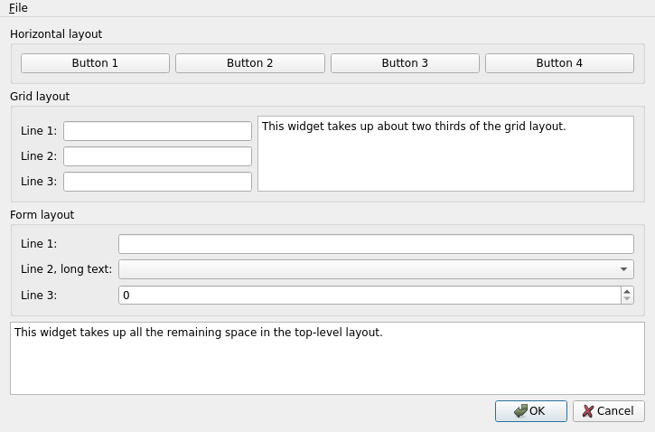
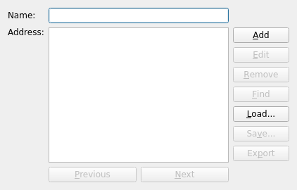
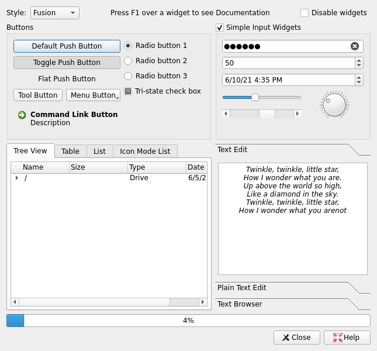

### Instructions on exercises

#### Exercise 1
Use the file layout.py

Create a window like this image: 

#### Exercise 2

Use the file basiclayouts.py

Create a window like the image below: 

#### Exercise 3

Use the file thread_signals.py

Goals:
1. When the button is clicked start a thread
2. Connect the thread's result signal to the print_result slot. Check that the result is printed.
3. Create a new progress signal. Create a print_progress slot. Connect the two together. The print_progress slot should print the progress in the form: `Work in Progress: 1/10`
4. Optional. Add a label to the window. Use this label to show the progress message. The message should update as the progress changes

#### Exercise 4
ChatGPT works very well with PySide2. Ask chatGPT to create a PySide2 applicatin for you. 
The result should look like the image below:

To easy? chatGPT created that simple window right away? Try with this other one :)

